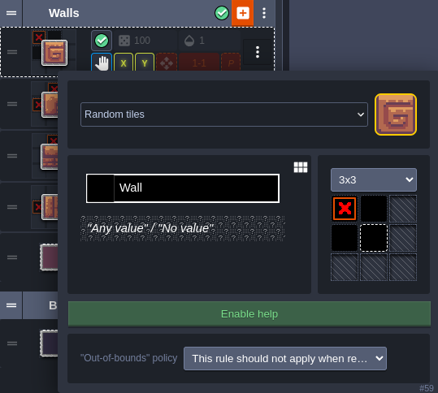
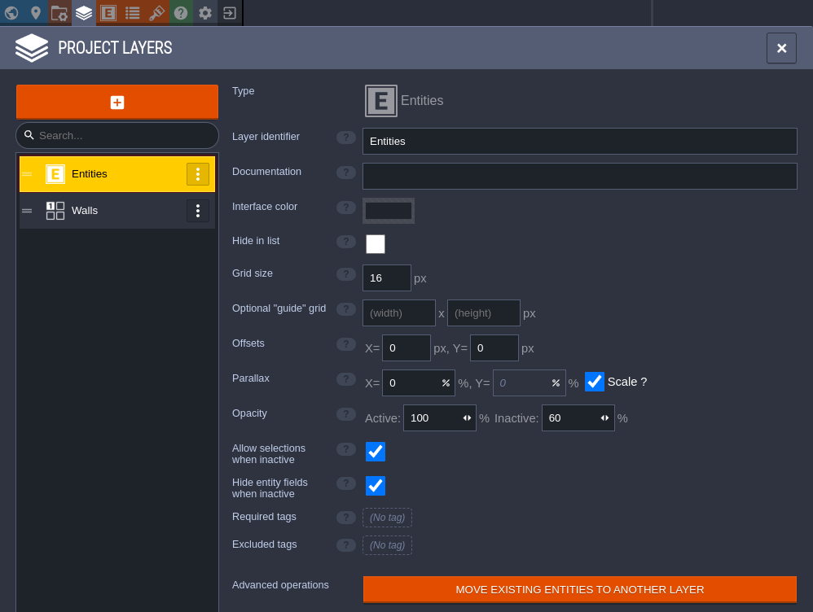
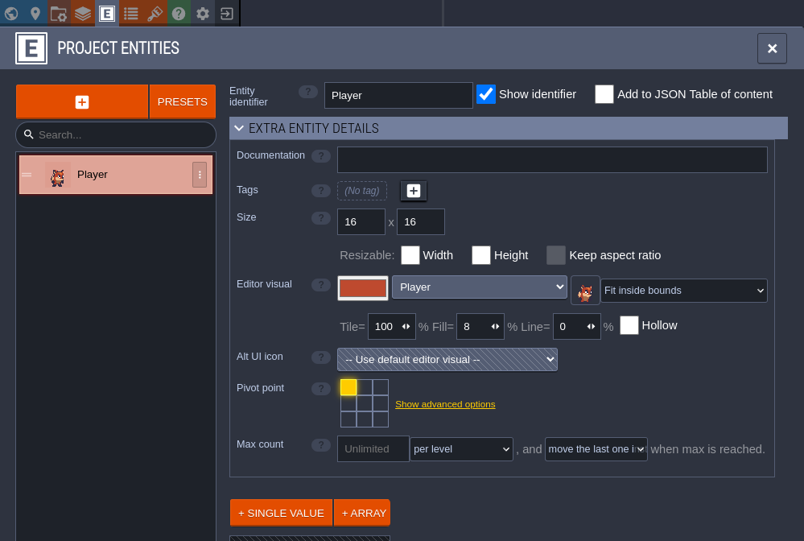

# Create your LDtk project
In this section, you will create a simple LDtk project suitable for tile-based gameplay.
This project will have an IntGrid layer of walls, and an Entity layer for placing Player and Goal entities.
It will also have AutoTile rules on top of the IntGrid layer defining the visuals of walls and backgrounds.
If you already have an LDtk project suitable for tile-based gameplay - feel free to skip this section.
However, note that some of the values specified in here will be used in the tutorial going forward, such as...
- the name/location of the file (assets/tile-based-game.ldtk)
- the identifiers of the Player and Goal entities (Player, Goal)
- the IntGrid value of walls (1)

For details about the tutorial in general, including prerequisites, please see the parent page.

## Create empty project
Open the LDtk app and create a new project.
For this tutorial, name the project `tile-based-game.ldtk`, and save it to your Bevy project's `assets` directory.

In the World tab - set the World layout to Horizontal.

## Import tilesets
Add your environment/player tilesets to the project, in the Tilesets tab.
Make sure that the source image files for these tilesets are also in your Bevy project's `assets` directory.
Name the tilesets "Environment" and "Player" respectively.
For the SunnyLand assets - the Player tileset needs to have a tile size of 32 and the environment asset a tile size of 16.

## Add IntGrid layer for walls
Add an IntGrid layer to the project, in the Layers tab.
This layer will be used to define where the collisions are in the level.
Call this layer "Walls", make sure its grid size is 16, and optionally name the grid value 1 "Wall".
Finally, give it an Auto-layer tileset - pointing to the "Environment" tileset.

## Define autotiling for walls and backgrounds
From here, select "EDIT RULES" next to the wall layer's auto-tile tileset.
This is where you will define how LDtk should dynamically render the Walls layer of your levels based of the level's intgrid values.

First, define a catch-all rule that will place the background tile if no other rules are matched first.
1. Select "+ GROUP" to add a new empty rule group, and name it Background.
2. On the new group, click "+" to define the first rule.
3. In the top-right of the rule definition - select the tile you want to use as the background.
4. You can set the rule to be "1x1", but since this is a "catch-all" rule, nothing else should be necessary.

Next, define a rule that will catch any wall tile.
You will be able to define more complex rules on top of this to make walls prettier, but it's good to start with an extremely generic one first.
1. Create another new group, and name it Walls.
2. Click "+" on the Walls group to create its first rule.
3. Select the tile you want to use as a generic wall tile in the top-right.
4. Set the rule to be 1x1, and left-click the rule-pattern to place a wall tile.

Now you will be able to place walls in your level and they will be automatically rendered using this tile.

The following rule is optional, and will define the tile used for the edges of walls - specifically horizontal edges.
1. Create a new rule in the Walls group.
2. Select the tile you want to use as the left edges of a wall.
3. Use a 3x3 pattern, and place a wall tile in the center and a negative wall tile on the left (by right clicking the left-center tile).
This will match any wall tiles that don't have a wall tile to their left.
4. On this new rule inside the group, enable the "X" option.
This mirrors the rule in the x-direction, so that it works for the right edges of walls as well.

You are welcome to add more rules to the walls group with more complex patterns for defining the vertical edges or corners.
This tutorial will not go into painstaking detail about creating these, but their definitions are shown below.
One general recommendation is to order these rules from most-specific to least-specific, so that the rule matcher will resort to the catch-all rules last.

A vertical wall edge rule - mirrored in the Y direction:

An outer corner wall rule - mirrored in the X and Y directions:

An inner corner wall rule - mirrored in the X and Y directions:

Now you can enjoy placing walls in your level and watching LDtk auto-tile them for you!

## Add Entity layer
Add an Entity layer to the project, again, in the Layers tab.
This will be used to place less tiling-oriented game objects, like the player, or the goal.
You do not need to make any modifications to the default entity layer for this tutorial, it should be called Entities and match the grid size of the intgrid layer.

Then, in the Entities tab, add a Player entity.
Be sure to name it "Player" and set its editor visual to use a tile from the Player tileset.
For the SunnyLand assets - you will need to manually set its size to 16x16 so that it fits in a single tile on the grid.

Lastly, add a Goal entity.
Name it "Goal" and set its editor visual from a tileset as well.

## Design some levels
In the following chapters, you will spawn this project in Bevy and implement gameplay code for it.
The game will be simple - move the player around the grid, navigating the walls, and start the next level once they reach the goal.
With this in mind, design a few levels for this game using the tools you have set up thus far.

