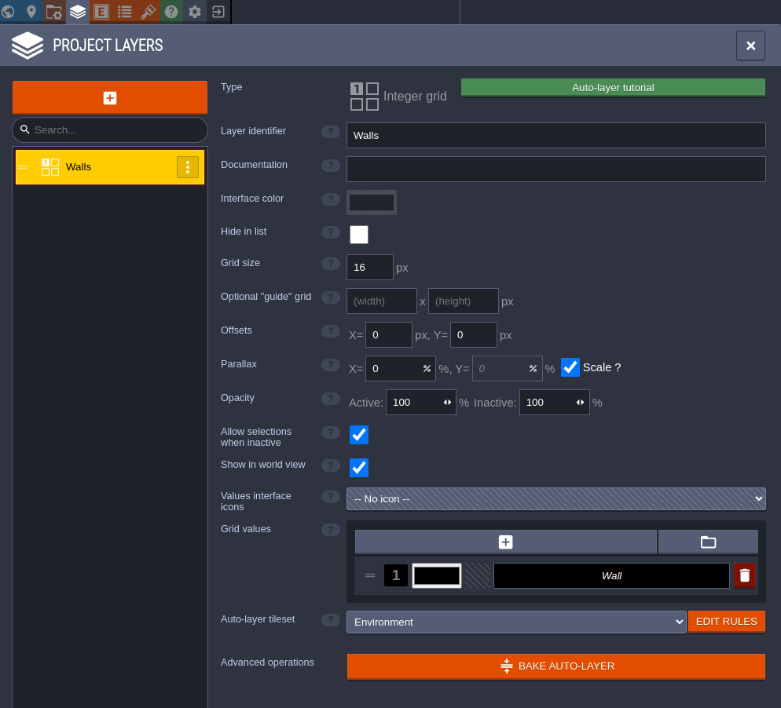

# Creating the LDtk project
Open the LDtk app and create a new project.
For this tutorial, name the project `tile-based-game.ldtk`, and save it to your Bevy project's `assets` directory.

Add your environment/player tilesets to the project, in the Tilesets tab.
Make sure that the source image files for these tilesets are also in your Bevy project's `assets` directory.
Name the tilesets "Environment" and "Player" respectively.
For the SunnyLand assets - the Player tileset needs to have a tile size of 32 and the environment asset a tile size of 16.

Add an IntGrid layer to the project, in the Layers tab.
This layer will be used to define where the collisions are in the level.
Call this layer "Walls", make sure its grid size is 16, and optionally name the grid value 1 "Wall".
Finally, give it an Auto-layer tileset - pointing to the "Environment" tileset.

From here, select "EDIT RULES" next to the wall layer's auto-tile tileset.
This is where you will define how LDtk should dynamically render the Walls layer of your levels based of the level's intgrid values.
